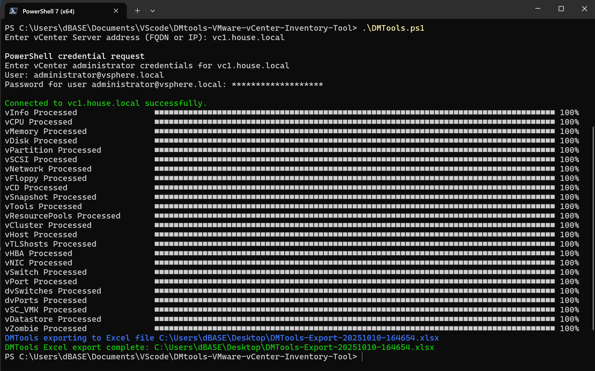

# DMtools — VMware vCenter Inventory Tool

PowerShell-based inventory tool for **VMware vCenter** environments. It collects data across clusters, hosts, VMs, datastores, networking (VSS/vDS), policies, snapshots, tags, and more — and outputs human-friendly reports.

> **Background & motivation**  
> DMtools was inspired by a popular executable-based VMware inventory utility. However, many high-security/locked-down environments prohibit running unsigned executables. By delivering an **auditable PowerShell script**, DMtools offers similar capabilities while allowing **source review**, change control, and easier security approval.

<p align="left">
  
  
  
  
</p>

---

## ✨ What it does

- Connects to a VMware vCenter and inventories the environment end‑to‑end.
- Exports a **single Excel workbook** (`.xlsx`) with multiple tabs (VMs, hosts, clusters, datastores,
  networks, snapshots, orphaned files, licenses, health alarms, and more).
- Shows clear progress for each collection phase.
- Installs missing dependencies (current user scope) on first run.

> See the script header for the full list of worksheets and fields.
>
> 

---

## 📦 Requirements

- Windows with **PowerShell 7+**
  - using **PowerShell 5.1+** (Windows PowerShell) may display yellow 'command Depreicated' warnings
- Network access to your vCenter Server.
- Privileges sufficient to read inventory across the desired scope.
- The following PowerShell modules will be installed automatically if missing:
  - `VMware.PowerCLI`
  - `ImportExcel`
  - `psInlineProgress`

If your environment restricts on‑the‑fly installs, pre‑stage modules in your profile or an internal
PSGallery mirror.

---

## 🚀 Quick start

1. Download `DMTools.ps1` from this repository.
2. (Optional) Unblock the script if your browser marked it as downloaded from the internet:
   ```powershell
   Unblock-File .\DMTools.ps1
   ```
3. Run the tool:
   ```powershell
   # PowerShell 7+
   .\DMTools.ps1
   ```
4. When prompted:
   - Enter the **vCenter FQDN/IP**.
   - Provide credentials (or use an existing PowerCLI session).
   - Choose a folder/file name for the Excel export.

The script will connect, collect, and write an Excel workbook with one tab per report.

---

## 🔐 Why a script (not an EXE)?

High‑security environments frequently block unsigned executables. A PowerShell script:
- is **transparent** and **reviewable** (ease of code review),
- can be **code‑signed** with your organization’s certificate,
- fits neatly into existing change‑control and allow‑listing workflows.

---

## 🧭 Usage notes

- Run from a workstation with access to vCenter and adequate RBAC permissions.
- For large environments, collection may take several minutes; progress is displayed inline.
- Output Excel files can be quite large; they are **git‑ignored** by default (`*.xlsx`).

---

## 🛠 Repository layout

```
DMtools-VMware-vCenter-Inventory-Tool/
├─ DMTools.ps1               # The tool (this repo’s core)
├─ LICENSE                   # MIT
├─ README.md                 # You are here
└─ .gitignore                # Ignore build artifacts and exports
```

---

## 🔏 Code signing (optional but recommended)

If your org requires signed scripts:

```powershell
# Import your code‑signing certificate from the Windows store
$cert = Get-ChildItem Cert:\CurrentUser\My -CodeSigningCert | Select-Object -First 1
Set-AuthenticodeSignature -FilePath .\DMTools.ps1 -Certificate $cert
```

## 🐞 Issues & contributions

- Found a bug or want a new worksheet/column? Open an **Issue** with details
  (PowerCLI/PowerShell versions, vCenter version, error text).
- PRs are welcome. Please run PSScriptAnalyzer and include a sample of the Excel output.  
- This project follows the **MIT License** (see `LICENSE`).

---

## ❓FAQ

**Q: Which modules are required?**  
A: `VMware.PowerCLI`, `ImportExcel`, `psInlineProgress`. The script will install them for the current
user if missing (or pre‑install per your policy).

**Q: Where does the data go?**  
A: Into one `.xlsx` file with multiple tabs, one per inventory category.

**Q: Can I filter scope (e.g., a subset of clusters)?**  
A: Use your vSphere permissions/connection scope; future flags can be discussed in issues.

---

## 🙌 Credits

- Original author: **Drew Mackay** ([@mackayd](https://github.com/mackayd))
- Thanks to the VMware community tools that inspired this script.
