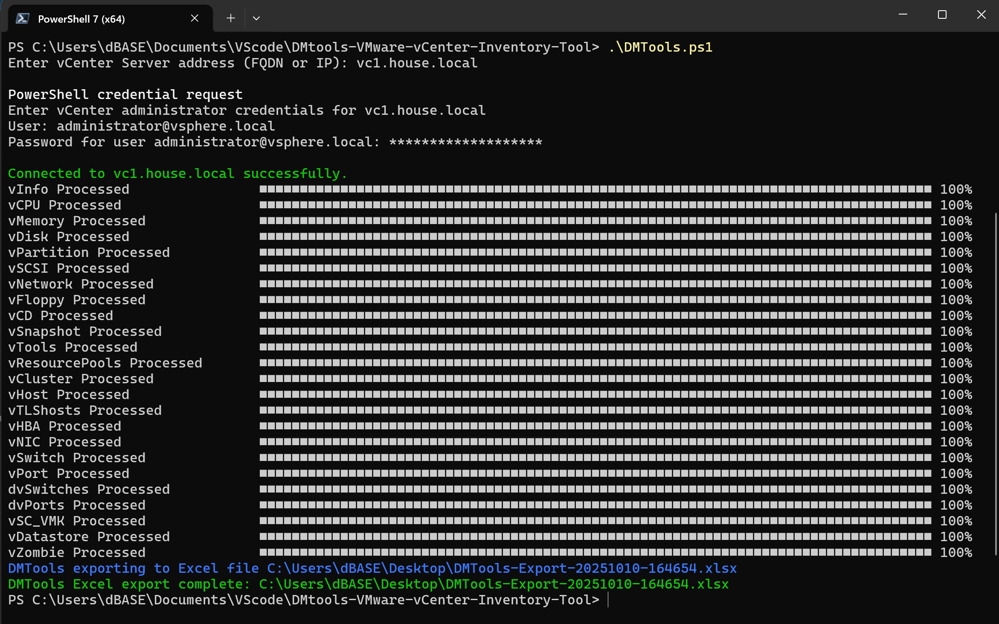

# DMtools — VMware vCenter Inventory Tool

PowerShell-based inventory tool for **VMware vCenter** environments. It collects data across clusters, hosts, VMs, datastores, networking (VSS/vDS), policies, snapshots, tags, and more — and outputs human-friendly Excel reports.

> **Background & motivation**  
> DMtools was inspired by a popular executable-based VMware inventory utility. However, many high-security or locked-down environments prohibit running unsigned executables. By delivering an **auditable PowerShell script**, DMtools offers similar capabilities while allowing **source review**, change control, and easier security approval.

<p align="left">
  
  
  
  
</p>

---

## ✨ What it does

- Connects to **one or more VMware vCenter servers** and inventories the environment end-to-end.
- Exports a **single Excel workbook** (`.xlsx`) with multiple tabs covering major inventory and configuration areas.
- When multiple vCenters are supplied, merges all collected rows into the same worksheets and adds a **`Source vCenter`** column so every row can be traced back to its source server.
- Supports either a **shared credential** across all vCenters or **interactive prompting per vCenter**.
- Offers **optional export redaction** to support safer report sharing.
- Shows clear progress for each collection phase.
- Installs missing dependencies (current user scope) on first run.

> See the script header for the full list of worksheets and fields.
>
> 

---

## 📦 Requirements

- Windows with **PowerShell 7+**
  - **PowerShell 5.1+** is also supported, though you may see yellow deprecation warnings for some commands
- Network access to each target vCenter Server
- Privileges sufficient to read inventory across the required scope
- The following PowerShell modules will be installed automatically if missing:
  - `VMware.PowerCLI`
  - `ImportExcel`
  - `psInlineProgress`

If your environment restricts on-the-fly installs, pre-stage the modules in your profile or an internal PSGallery mirror.

---

## 🚀 Quick start

1. Download `DMtools.ps1` from this repository.
2. (Optional) Unblock the script if your browser marked it as downloaded from the internet:
   ```powershell
   Unblock-File .\DMtools.ps1
   ```
3. Run the tool:
   ```powershell
   .\DMtools.ps1
   ```

### Example: single vCenter

```powershell
.\DMtools.ps1 -vCenter vcsa01.example.local
```

### Example: multiple vCenters with one shared credential

```powershell
$cred = Get-Credential
.\DMtools.ps1 -vCenter vcsa01.example.local,vcsa02.example.local -Credential $cred
```

### Example: multiple vCenters with interactive prompts

```powershell
.\DMtools.ps1 -vCenter vc8.house.local,t-vc8.house.local
```

When prompted:

- Enter one or more **vCenter FQDNs/IPs** if not already supplied
- Choose whether **redaction** should be applied to the export
- Provide either:
  - a single reusable credential with `-Credential`, or
  - credentials interactively as each vCenter is processed
- Choose the destination for the Excel export

The script will connect to each requested vCenter, collect the data, and write one consolidated Excel workbook with one tab per report.

---

## 🧩 Multi-vCenter support

DMtools supports collecting inventory from **multiple vCenters in a single execution** and writing all results into **one consolidated Excel report**.

### How it works

- Pass one or more vCenters to the `-vCenter` parameter
- DMtools processes each vCenter in sequence
- All collected data is merged into one workbook
- Each exported row includes a **`Source vCenter`** column
- Consumers can filter workbook data by the originating vCenter when required

This is especially useful for:

- multi-site environments
- estates with separate production, management, and test vCenters
- migration and comparison exercises
- centralised reporting across multiple vSphere platforms

---

## 🔐 Authentication options

DMtools supports two main connection models.

### 1. Shared credential across all vCenters

If the same credential works across all target vCenters, pass it once using `-Credential`.

```powershell
$cred = Get-Credential
.\DMtools.ps1 -vCenter vc8.house.local,t-vc8.house.local -Credential $cred
```

### 2. Prompt per vCenter

If `-Credential` is omitted, DMtools prompts as it connects to each vCenter. This is useful when:

- different vCenters require different credentials
- you do not want to pre-store credentials in a variable
- operators prefer an interactive workflow

---

## 🕶️ Redaction support

Before collection begins, DMtools offers optional redaction for the Excel export. This is useful when the report needs to be shared outside the core administration team.

Typical redaction areas include:

- VM names
- VM FQDN domain suffixes
- IP addresses
- ESXi / vCenter resource names
- ESXi / vCenter FQDN domain suffixes

The script includes logic intended to avoid corrupting non-target values such as MAC addresses, API version values, and timestamps.

---

## 🔐 Why a script (not an EXE)?

High-security environments frequently block unsigned executables. A PowerShell script:

- is **transparent** and **reviewable**
- can be **code-signed** with your organization’s certificate
- fits neatly into existing change-control and allow-listing workflows
- is easier to inspect, version, diff, and adapt than a compiled binary

This makes DMtools particularly useful in regulated or security-conscious environments.

---

## 🧭 Usage notes

- Run from a workstation with access to the target vCenters and adequate RBAC permissions.
- For large environments, collection may take several minutes; progress is displayed inline.
- Output Excel files can be quite large; they are **git-ignored** by default (`*.xlsx`).
- When collecting from multiple vCenters, use the **`Source vCenter`** column in Excel to filter or separate the data by source platform.

---

## 📄 Output

DMtools creates a **single `.xlsx` workbook** containing multiple worksheets.

### Output characteristics

- one workbook per run
- one worksheet per inventory category
- consolidated data from all requested vCenters
- a trailing **`Source vCenter`** column on each exported row
- suited to audit, migration assessment, discovery, CMDB population, and documentation tasks

Example output filename pattern:

```text
DMTools-Export-YYYYMMDD-HHMMSS.xlsx
```

---

## 🛠 Repository layout

```text
DMtools-VMware-vCenter-Inventory-Tool/
├─ DMtools.ps1               # The tool (this repo’s core)
├─ LICENSE                   # MIT
├─ README.md                 # You are here
└─ .gitignore                # Ignore build artifacts and exports
```

---

## 🔏 Code signing (optional but recommended)

If your organization requires signed scripts:

```powershell
# Import your code-signing certificate from the Windows store
$cert = Get-ChildItem Cert:\CurrentUser\My -CodeSigningCert | Select-Object -First 1
Set-AuthenticodeSignature -FilePath .\DMtools.ps1 -Certificate $cert
```

---

## ✅ Recommended use cases

DMtools is well suited to:

- estate discovery
- technical due diligence
- migration planning
- audit preparation
- CMDB population support
- operational documentation
- platform comparison across multiple vCenters
- filtered reporting for management, test, and production estates

---

## 🐞 Issues & contributions

- Found a bug or want a new worksheet or column? Open an **Issue** with details such as:
  - PowerShell version
  - PowerCLI version
  - vCenter version
  - error text
- PRs are welcome. Please run `PSScriptAnalyzer` and include a sanitised sample of the Excel output where relevant.
- This project follows the **MIT License**.

---

## ❓FAQ

**Q: Which modules are required?**  
A: `VMware.PowerCLI`, `ImportExcel`, and `psInlineProgress`. The script will install them for the current user if missing, or you can pre-install them per your policy.

**Q: Where does the data go?**  
A: Into one `.xlsx` file with multiple tabs, one per inventory category.

**Q: What happens when I use multiple vCenters?**  
A: DMtools merges the collected rows into the same workbook tabs and appends a `Source vCenter` column so the origin of each row remains clear.

**Q: Can I reuse one credential for every vCenter?**  
A: Yes. Pass `-Credential` if the same account works across all targets. Otherwise, omit it and the script will prompt per vCenter.

**Q: Can I filter scope to a subset of the platform?**  
A: Use your vSphere permissions and connection scope. Additional filtering options can be discussed through issues or future enhancements.

---

## 🙌 Credits

- Original author: **Drew Mackay** ([@mackayd](https://github.com/mackayd))
- Thanks to the VMware community tools that inspired this script.
